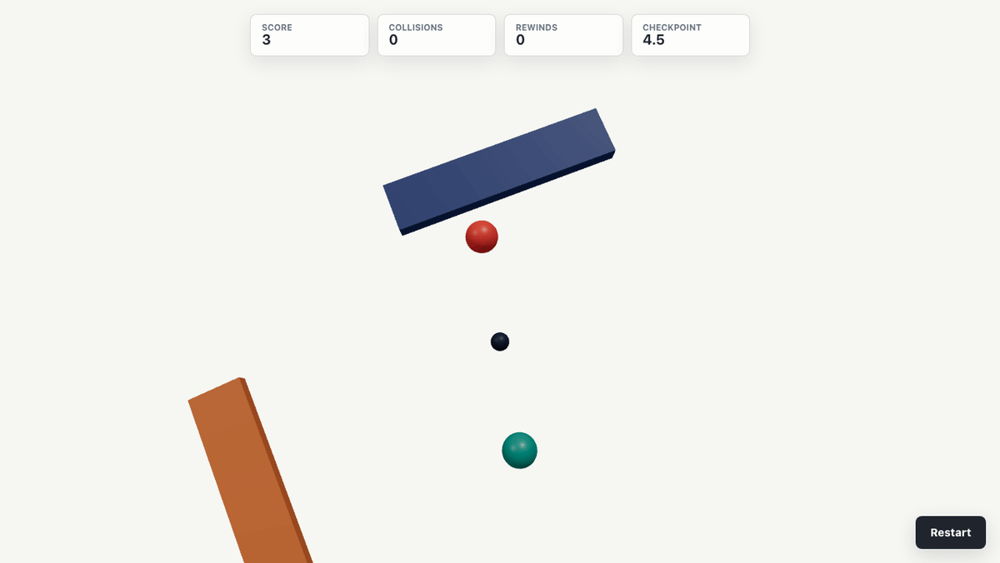

# Dual Orbit



**Play it live:** <https://steady-puppy-680814.netlify.app/>

> A deterministic orbital dodging game built with React, React Three Fiber and
> TypeScript — ported from a Phaser original into a renderer-independent
> simulation.

The core idea of **Dual Orbit** is simple and tense: two orbs orbit a shared
center, rotating in lockstep. The player rotates the pair left or right to
thread through an endless stream of procedurally generated obstacles. Every
collision rewinds time back through the player's own recorded inputs and tries
again. The game is about *rotation vs rotation*, not movement.

See [`docs/mvp.md`](./docs/mvp.md) for the port plan and
[`docs/simulation-architecture.md`](./docs/simulation-architecture.md) for the
reverse-engineered simulation design, and [`docs/sample.md`](./docs/sample.md)
for how the header GIF is produced.

---

## What it is

| System        | Capability                                                        |
| ------------- | ---------------------------------------------------------------- |
| Orbit         | Dual-orb angular motion, clockwise / counterclockwise rotation     |
| Obstacles     | Static, moving and angular obstacles with procedural placement    |
| Collision     | Circle vs rectangle / rotated rectangle, math-driven and exact   |
| Rewind        | Deterministic input-replay rewind on every collision             |
| Generator     | Level / group progression with chance curves and weighted waves   |
| Rendering     | React Three Fiber on simple primitives (spheres, cubes, boxes)    |
| UI            | HUD overlay (score, collisions, rewinds, checkpoint) in HTML/CSS  |

Everything runs in the browser. There is no backend.

---

## Why this project

The original Phaser game derived its value from **deterministic gameplay**:
fixed-timestep simulation, exact rotation math, deterministic obstacle spacing
and an input-replay rewind. None of that depends on rendering.

The port preserves that property. The simulation is pure TypeScript with no
React, no Three.js and no browser APIs — it can run in a console, in Node, or
in a test. React Three Fiber only observes snapshots. Because the simulation
is deterministic, the exact same inputs always produce the exact same kin
ematics. That determinism is what makes an **automated bot driver** possible:
instead of a human flailing at the controls, a script computes the precise
inputs needed to produce readable gameplay moments and the screenshots are
taken from the deterministic result. The animated GIF at the top of this file
is produced that way — see
[`docs/sample.md`](./docs/sample.md).

---

## Stack

- **React + TypeScript + Vite** — application shell and HUD
- **Three.js, React Three Fiber, Drei** — 3D rendering
- **Zustand** — UI state only (simulation never reads from it)
- **Biome** — lint and format
- **Vitest + Playwright** — simulation unit tests and screenshot capture
  (planned — see [`docs/sample.md`](./docs/sample.md))

The simulation is decoupled from rendering. The fixed-timestep loop advances
identically in the browser, in Node and in tests; React interpolates for
display only.

---

## Run

Prerequisites: Node and a browser with WebGL.

```sh
pnpm install
pnpm dev       # http://localhost:5173
pnpm build     # type-check + production build to dist/
pnpm preview   # serve the production build
```

### Lint and format

```sh
pnpm check     # biome check
pnpm format    # biome format
pnpm lint      # biome lint
```

---

## Controls

| Action           | Input                          |
| ---------------- | ------------------------------ |
| Rotate left      | `←` left arrow                 |
| Rotate right     | `→` right arrow                |
| (Optional) left  | `A`                            |
| (Optional) right | `D`                            |
| Restart          | the on-screen button           |

The core mechanic is rotation, not translation: pressing left or right spins
the orbiting pair. Collisions are not instant death — they trigger a rewind
through your recorded inputs, which restores the prior obstacles and lets you
correct.

---

## Architecture

```
src/
  game/
    simulation/
      orbit/        dual-orb angular motion, stability, vertical motion
      obstacles/    movement, collision checks, shrink/rollback helpers
      generator/    archetypes, chance curves, wave expansion
      rewind/       direction memory, reverse stepping
      progression/  endless level / group advancement
      core/         tick orchestration, fixed timestep, simulator factory
    constants/     preserved gameplay constants
    math/           collision geometry, angles, scalars
    types/          shared state types and discriminated unions
  scene/           R3F scene, camera, world-coordinate mapping
  entities/        Orbit and obstacle R3F entities
  hooks/            keyboard input
  App.tsx           composes R3F <Canvas> + GameScene + HTML HUD
```

The simulation modules own all gameplay rules. React, Zustand and R3F consume
snapshots but never define behavior. The fixed-timestep loop is decoupled from
the variable render rate, so it advances identically in the browser, in Node
and in tests.

See [`docs/simulation-architecture.md`](./docs/simulation-architecture.md) for
the reverse-engineered module boundaries and update order.

---

## Regenerating the header GIF

The header animation is generated automatically: a Playwright capture spec
boots the game, a deterministic bot driver replays curated inputs through the
simulation, the running scene is screenshotted at chosen ticks, and ffmpeg
assembles a looping GIF. By default the spec plays a *showcase sequence* —
one teleport per gameplay place (a static pair, a rotating bar, a moving bar,
a slow `angular_long` sweep, a mixed frame) — so consecutive GIF frames show
distinct obstacle kinds rather than the same row at different orb angles.
Run from the repo root:

```sh
scripts/build-readme-header.sh
```

(The script's Playwright `webServer` builds the app itself with the bot
bridge opted in; no separate `pnpm build` needed.)

Output goes to `docs/readme-header.gif`. This is not an E2E coverage suite —
the goal is to capture readable gameplay diversity from a deterministic run.
Set `SCENARIO=rotatingFieldScenario|nearMissRewindScenario` (or another
export from `src/game/bot/scenarios.ts`) to capture just one scenario
instead of the showcase sequence. See [`docs/sample.md`](./docs/sample.md)
for the full implementation plan.

---

## Roadmap

The MVP is **mechanical parity** with the Phaser original — graphics are
simple primitives. Post-MVP targets, after gameplay parity is verified:

- Visual redesign (models, textures, shaders)
- VFX and postprocessing
- Audio
- Camera polish
- Mobile controls
- Performance optimization
- Procedural environments

See [`docs/mvp.md`](./docs/mvp.md) for the phase-by-phase port plan.
